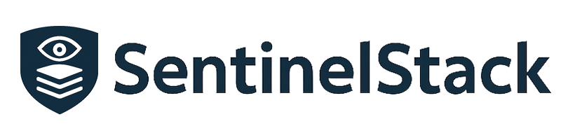

<picture>
  <source media="(prefers-color-scheme: dark)" srcset="docs/images/sentinelstack-darkmode-logo.png">
  <source media="(prefers-color-scheme: light)" srcset="docs/images/sentinelstack-white-bg.png">
  
</picture>

#

SentinelStack is an open-source, healthcare-ready cloud platform that provides system reliability monitoring, security controls, and immutable audit trails for regulated web applications.

It is designed for environments where downtime, data exposure, and undocumented decisions carry real risk, such as healthcare, life sciences, and enterprise SaaS.

> **TL;DR**  
> SentinelStack is an open-source, audit-first monitoring platform designed for regulated environments, prioritizing human accountability, system transparency, and compliance-ready observability.

---

## Core Principles

SentinelStack emphasizes:

- **Human-in-the-loop decision making**
- **Least-privilege access**
- **Audit-first architecture**
- **Operational accountability**

---

## Why SentinelStack Exists

Healthcare systems struggle to answer basic but critical questions:

- Is our system healthy right now?
- Who changed something before the outage?
- Can we prove compliance during an audit?
- Why did we make this decision?

SentinelStack exists to observe systems, detect issues early, record human decisions, and provide audit-ready visibility — without risky automation.

---

## What SentinelStack Does

- Observes service health and system reliability
- Tracks incidents and response timelines
- Records all actions in immutable audit logs
- Enforces role-based access control (RBAC)
- Provides operational visibility and insights
- Supports optional ML-assisted anomaly detection

> **⚠️ Important:** SentinelStack does not auto-remediate or act autonomously. Humans remain responsible at all times.

---

## Architecture

SentinelStack uses a modular, cloud-native architecture designed for auditability, scalability, and clear ownership of responsibility.

- [High-Level Architecture](docs/architecture.md)
- [Domain Model](docs/domain-model.md)
- [Incident Lifecycle / Data Flow](docs/data-flow.md)

---

## Security & Compliance Principles

- Role-based access control (RBAC)
- Immutable, append-only audit logs
- Encryption at rest and in transit
- Explicit ownership of actions
- No silent data modification

---

## Demo Application

SentinelStack includes **ClinicFlow**, a small demo healthcare application that simulates:

- Patient registration (synthetic data only)
- Appointment scheduling
- Exam room assignment

ClinicFlow exists solely to demonstrate how SentinelStack integrates with real applications.

---

## Status

- 🚧 **Actively developed**
- 🧪 **Demo environment only**
- ❗ **Not intended for production healthcare use**

---

## Roadmap

- Advanced analytics dashboards
- ML-assisted anomaly detection
- Expanded compliance documentation
- Multi-tenant support
