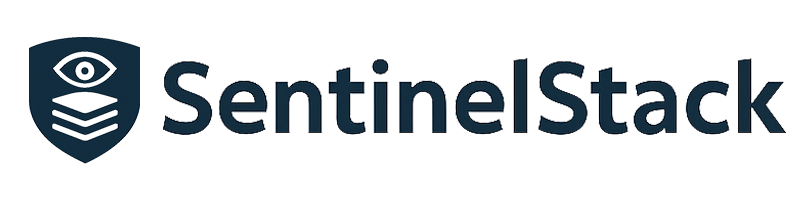

<div align="center">

<picture>
  <source media="(prefers-color-scheme: dark)" srcset="docs/images/sentinelstack-darkmode-logo.png">
  <source media="(prefers-color-scheme: light)" srcset="docs/images/sentinelstack-white-bg.png">
  
</picture>

<br/>

<a href="https://github.com/aphaiboon/sentinelstack">
  
</a>

</div>

#

SentinelStack is an open-source **backend API engine** for incident management in regulated environments. It handles multi-tenant incident tracking, service registry, escalation workflows, webhook ingestion, SAML SSO, and immutable audit trails — and exposes all of it over a REST API that your own frontend, CLI, or tooling calls.

There is no bundled UI. This is intentional. SentinelStack is the engine you build on top of.

> **TL;DR**  
> A production-ready, HIPAA-conscious incident management REST API. Bring your own frontend. Deploy on AWS ECS + PostgreSQL.

---

## How It Works

SentinelStack sits in the middle of your ops stack and connects three things:

```
Monitoring tools          SentinelStack API          Your tooling
─────────────────         ─────────────────          ──────────────
Datadog          ──POST──▶ Webhook Ingest   ◀──────▶ Your dashboard
PagerDuty        ──POST──▶ → creates        ◀──────▶ Your CLI
Prometheus       ──POST──▶   Incident       ◀──────▶ Your Slack bot
Custom alerts    ──POST──▶                  ◀──────▶ Postman / curl
```

1. **Monitoring tools push alerts in** via `POST /api/v1/webhooks/ingest/{key}`. SentinelStack validates the signature and creates an incident automatically.
2. **Your team responds** via whatever client you build or use — a web dashboard, a Slack bot, a CLI. They call the API to acknowledge, investigate, and resolve incidents.
3. **Escalation policies run in the background.** If an incident isn't acknowledged within a configured time window, Hangfire fires escalation steps and sends notifications (email, SMS, Slack) up the chain.
4. **Every action is captured.** The audit log records who did what, when, from where — immutably. Compliance teams query it directly via the API.

---

## Core Principles

- **Audit-first architecture** — every action is logged immutably
- **Human-in-the-loop** — no silent auto-remediation
- **Least-privilege access** — role-based, tenant-scoped
- **Compliance-ready** — HIPAA-aligned logging, append-only audit trails, schema-per-tenant isolation for healthcare

---

## Features

### Implemented

| Feature | Description |
|---|---|
| **JWT Authentication** | Access + refresh token flow, BCrypt password hashing, account lockout |
| **SAML 2.0 SSO** | SP/IdP-initiated flows, dynamic per-tenant IdP config, auto-provisioning (Enterprise/Healthcare tiers) |
| **Multi-Tenancy** | `X-Tenant-Id` header + JWT claim validation, EF Core global query filters, shared schema (default) or schema-per-tenant (Healthcare) |
| **Incident Management** | Full lifecycle: Open → Acknowledged → Investigating → Resolved → Closed. Severity levels, assignment, soft delete |
| **Service Registry** | Service catalogue with unique keys, owner teams, activation/deactivation |
| **Escalation Policies** | Multi-step escalation with configurable delays, repeat-on-unack, notification routing (Email, SMS, Slack) |
| **Webhook Ingestion** | Public ingest endpoint with HMAC-SHA256 signature validation, JSON path field mapping, multiple source types (Datadog, PagerDuty, Prometheus, Custom) |
| **Audit Logging** | Immutable append-only audit trail with entity diffs, IP address, user agent, correlation IDs |
| **Background Jobs** | Hangfire with PostgreSQL storage — escalation processing every 5 minutes |
| **Structured Logging** | Serilog → AWS CloudWatch with tenant/user enrichers, HIPAA-compliant (no PHI in logs) |
| **Health Checks** | Liveness, readiness (DB), and full health endpoints for ECS health monitoring |
| **Email Notifications** | AWS SES integration with incident lifecycle templates |

---

## Architecture

Clean Architecture with four layers:

```
src/
├── SentinelStack.Api/            # ASP.NET Core — controllers, middleware, DI wiring
├── SentinelStack.Application/    # Use cases — commands, queries, DTOs, interfaces
├── SentinelStack.Domain/         # Entities, enums, domain events, base classes
└── SentinelStack.Infrastructure/ # EF Core, repositories, JWT, Hangfire, AWS, SAML
```

**Request flow:**

```
HTTP Request
  → TenantContextMiddleware (validates X-Tenant-Id vs JWT tenantIds claim)
  → Controller
  → Application Command/Query
  → Infrastructure Repository (EF Core with global tenant filter)
  → PostgreSQL
```

### Domain Entities

`Tenant` · `User` · `Incident` · `Service` · `EscalationPolicy` · `EscalationStep` · `WebhookEndpoint` · `AuditLog` · `SamlConfiguration`

### Multi-Tenancy

All protected endpoints require an `X-Tenant-Id` header. The middleware validates it against the `tenantIds` claim in the JWT before the request reaches any business logic.

| Tier | Isolation | SAML SSO |
|---|---|---|
| Free / Starter / Growth | Shared schema (row-level) | — |
| Enterprise | Shared schema (row-level) | ✓ |
| Healthcare | Schema-per-tenant (HIPAA) | ✓ |

---

## Tech Stack

| Layer | Technology |
|---|---|
| Runtime | .NET 10 |
| Web Framework | ASP.NET Core 10 |
| ORM | Entity Framework Core 9 + Npgsql |
| Database | PostgreSQL 16 |
| Auth | JWT Bearer + BCrypt + Sustainsys SAML2 |
| Background Jobs | Hangfire 1.8 (PostgreSQL storage) |
| Logging | Serilog → AWS CloudWatch |
| Secrets | AWS Secrets Manager |
| Email | AWS SES |
| Validation | FluentValidation |
| Messaging | MediatR |
| API Docs | Swagger / Scalar |
| Infrastructure | AWS ECS Fargate + RDS + ALB + Route53 (Terraform) |
| CI/CD | GitHub Actions |
| Testing | xUnit + FluentAssertions + Testcontainers + Bogus |

---

## API Overview

All endpoints are versioned under `/api/v1/`. Protected endpoints require `Authorization: Bearer <token>` and `X-Tenant-Id: <guid>`.

| Group | Endpoints |
|---|---|
| **Auth** | `POST /auth/login` · `POST /auth/refresh` · `POST /auth/logout` |
| **SAML** | `GET /auth/saml/login` · `POST /auth/saml/acs` · `GET /auth/saml/metadata` |
| **Incidents** | Full CRUD + `acknowledge` · `resolve` actions |
| **Services** | Full CRUD + `activate` · `deactivate` actions |
| **Users** | Full CRUD + `GET /users/me` |
| **Escalation Policies** | Full CRUD + `activate` · `deactivate` · `set-default` |
| **Webhooks** | Full CRUD + public `POST /webhooks/ingest/{key}` |
| **Audit Logs** | Read-only — by entity, by user, login activity |
| **Admin / Tenants** | `POST` · `GET` tenant management (PlatformAdmin role) |
| **Admin / SAML Config** | SAML IdP configuration per tenant |
| **Health** | `/health` · `/health/live` · `/health/ready` |

Full Swagger documentation available at `/swagger` when running locally.

---

## Getting Started

### Prerequisites

- [.NET 10 SDK](https://dotnet.microsoft.com/download)
- [Docker](https://www.docker.com/) (for PostgreSQL)

### Local Development

```bash
# 1. Clone the repo
git clone https://github.com/aphaiboon/SentinelStack.git
cd SentinelStack

# 2. Start PostgreSQL
cp .env.example .env
docker-compose up -d

# 3. Apply database migrations
cd src/SentinelStack.Api
dotnet ef database update

# 4. Run the API
dotnet run
```

The API starts at `http://localhost:5000`. Use `http://localhost:5000/swagger` to browse and test all endpoints interactively — useful for exploring the API before building a client against it.

### Configuration

Copy `.env.example` to `.env` and set:

| Variable | Description |
|---|---|
| `DATABASE_CONNECTION_STRING` | PostgreSQL connection string |
| `JWT_SECRET` | Minimum 32-character secret for JWT signing |
| `AWS_REGION` | AWS region (for SES/CloudWatch in production) |
| `HANGFIRE_DASHBOARD_PASSWORD` | Password for `/hangfire` dashboard |

In production, secrets are pulled from AWS Secrets Manager automatically.

---

## Testing

```bash
# Unit tests (domain + infrastructure)
dotnet test tests/SentinelStack.Domain.UnitTests
dotnet test tests/SentinelStack.Infrastructure.Tests

# Integration tests (requires Docker for Testcontainers)
dotnet test tests/SentinelStack.Api.IntegrationTests
```

Integration tests spin up a real PostgreSQL instance via Testcontainers and test the full HTTP stack including auth, tenant middleware, and database interactions.

---

## Infrastructure

Terraform modules in `terraform/` provision the full AWS stack:

- **VPC** — public/private subnets, NAT Gateway, security groups
- **ECS** — Fargate cluster, task definition, auto-scaling (CPU/memory)
- **RDS** — PostgreSQL 16, Multi-AZ in production, 30-day backups
- **ALB** — HTTPS with ACM certificate
- **ECR** — Container registry
- **Secrets Manager** — DB credentials, JWT secret, SMTP credentials
- **Route53 / DNS** — ACM validation, optional DNS record

```bash
cd terraform/environments/dev
terraform init
terraform apply
```

---

## CI/CD

| Trigger | Pipeline |
|---|---|
| Push / PR to `main` or `develop` | Build → Format check → Unit tests → Integration tests → Security scan |
| Tag `v*` or manual dispatch | Build Docker image → Push to GHCR → Deploy staging → Deploy production |

---

## Status

- Actively developed — core platform complete
- Not intended for production healthcare use without further security review
- Demo environment only

---

## Roadmap

**API engine (this repo):**
- On-call schedule management
- Slack / PagerDuty native integrations
- Advanced analytics and SLA tracking endpoints
- Mobile push notification support

**Planned companion projects:**
- Web dashboard (frontend UI for incident management)
- CLI tool for ops engineers
- Slack app for on-call workflows
