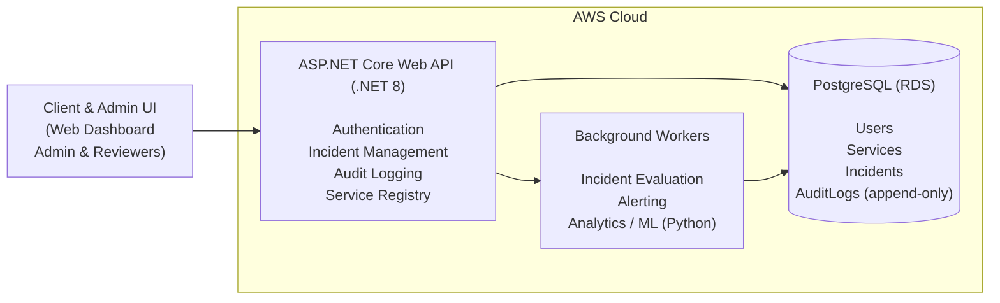

# SentinelStack — High-Level Architecture

```mermaid
flowchart LR
    Client["Client & Admin UI<br/>(Web Dashboard<br/>Admin & Reviewers)"]

    API["ASP.NET Core Web API (.NET 8)<br/><br/>Authentication<br/>Incident Management<br/>Audit Logging<br/>Service Registry"]

    Workers["Background Workers<br/><br/>Incident Evaluation<br/>Alerting<br/>Analytics / ML (Python)"]

    DB[("PostgreSQL (RDS)<br/><br/>Users<br/>Services<br/>Incidents<br/>AuditLogs (append-only)")]

    Client --> API
    API --> DB
    API --> Workers
    Workers --> DB

    subgraph Cloud["AWS Cloud"]
        API
        Workers
        DB
    end
```
