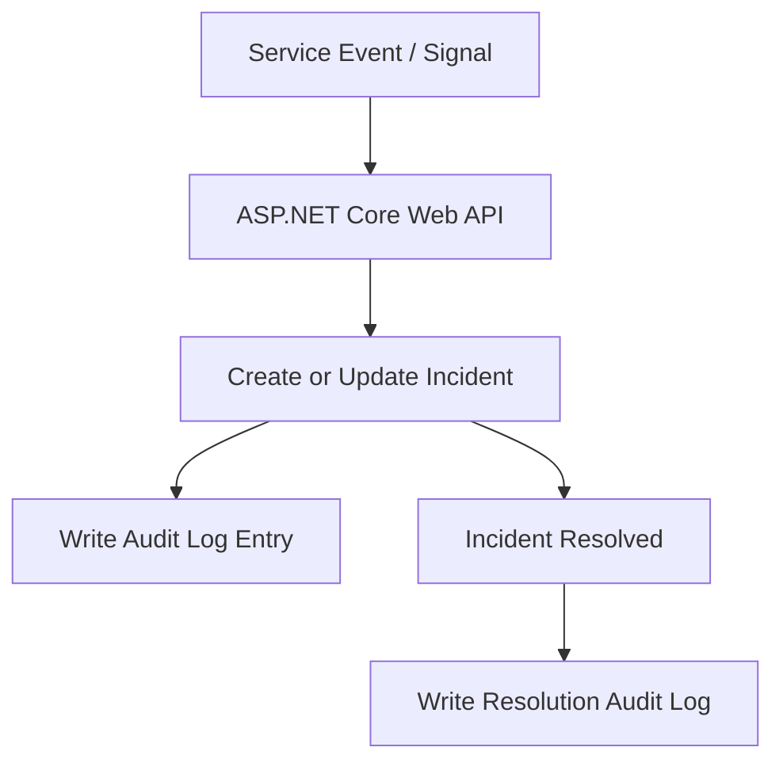

# SentinelStack — Incident Lifecycle & Data Flow

This diagram illustrates how SentinelStack handles incidents from initial detection through resolution,
with audit logging at every step.

## Design Notes

- All state changes are mediated through the API
- Audit logs are written for **every meaningful action**
- Resolution is a first-class, auditable event
- No automated remediation occurs without human involvement
