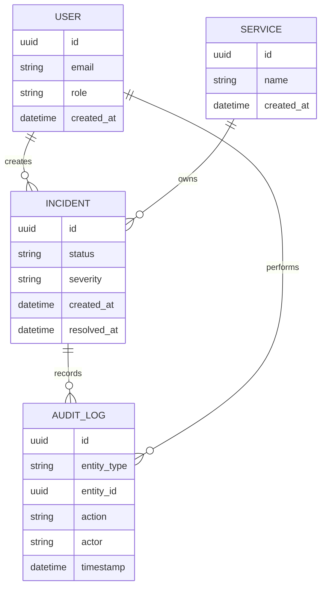

# SentinelStack — Domain Model

This document describes the core domain entities within SentinelStack and how they relate to one another.  
The model is intentionally minimal and audit-focused, reflecting regulated healthcare environments.

## Design Notes

- **AuditLog** is append-only and immutable
- **Incident** represents a real operational event, not a synthetic alert
- **User actions** are always explicitly recorded
- The model favors traceability over optimization
